# Azure Terraform Module Architecture

## 1. Introduction & Overview

**Purpose:** This document provides a comprehensive architectural framework for creating robust, maintainable, and secure Azure Terraform modules. It serves as the visual and conceptual foundation that complements the detailed "Azure Terraform Module Code Guidelines."

**Goals:**
- **Consistency:** Standardized architectural patterns across all modules
- **Security-First:** Embedded security patterns from design phase
- **Visual Clarity:** Clear architectural diagrams for complex concepts
- **Scalability:** Modular design enabling enterprise-scale deployments
- **Developer Experience:** Intuitive interfaces with comprehensive validation
- **Maintainability:** Clear separation of concerns and predictable structure


## 2. Core Architectural Principles

### 2.1 Foundational Design Principles


### 2.2 Security-First Architecture


## 3. Module Structure & Organization

### 3.1 Enhanced Module File Architecture

```mermaid
graph TD
    subgraph "Module Root Directory"
        direction TB
        
        subgraph "Core Configuration Files"
            MAIN[main.tf<br/>📁 Primary Resources]
            VARS[variables.tf<br/>📝 Input Definitions]
            OUTS[outputs.tf<br/>📤 Export Definitions]
            VERS[versions.tf<br/>🔧 Provider Constraints]
        end
        
        subgraph "Resource-Oriented Files (Optional)"
            NET[network.tf<br/>🌐 Network Resources]
            SEC[security.tf<br/>🔒 Security Resources]
            MON[monitoring.tf<br/>📊 Diagnostic Settings]
            RBAC[rbac.tf<br/>👥 Role Assignments]
        end
        
        subgraph "Variable Organization"
            VARS_NET[variables.network.tf<br/>🌐 Network Variables]
            VARS_SEC[variables.security.tf<br/>🔒 Security Variables]
        end
        
        subgraph "Documentation & Examples"
            README[README.md<br/>📖 Complete Documentation]
            
            subgraph "examples/"
                BASIC[basic/<br/>🏃‍♂️ Minimal Example]
                COMPLETE[complete/<br/>🎯 All Features]
                ADVANCED[advanced/<br/>🚀 Complex Scenarios]
            end
        end
        
        subgraph "Testing (Optional)"
            TESTS[tests/<br/>🧪 Test Definitions]
        end
    end
    
    MAIN --> NET
    MAIN --> SEC
    VARS --> VARS_NET
    VARS --> VARS_SEC
    
    style MAIN fill:#e3f2fd,stroke:#1976d2,stroke-width:3px
    style README fill:#fff3e0,stroke:#f57c00,stroke-width:2px
    style BASIC fill:#e8f5e8,stroke:#388e3c,stroke-width:2px
    style COMPLETE fill:#fce4ec,stroke:#c2185b,stroke-width:2px
```

### 3.2 Resource-Oriented File Separation Strategy

```mermaid
flowchart TD
    START([Module Design Phase]) --> ASSESS{Assess Module Complexity}
    
    ASSESS -->|Simple<br/>1-2 Resources| SINGLE[Single File Approach<br/>Everything in main.tf]
    ASSESS -->|Complex<br/>3+ Resources| MULTI[Multi-File Approach<br/>Resource-Oriented Split]
    
    MULTI --> IDENTIFY[Identify Resource Categories]
    IDENTIFY --> SPLIT{Split Strategy}
    
    SPLIT -->|Pattern 1| MAIN_RESOURCE[Main Resource Pattern<br/>Primary resource in main.tf<br/>Related resources in separate files]
    SPLIT -->|Pattern 2| COORDINATOR[Coordinator Pattern<br/>Only locals/modules in main.tf<br/>All resources in category files]
    
    MAIN_RESOURCE --> EXAMPLE1[Example: Storage Account Module<br/>• main.tf: azurerm_storage_account<br/>• containers.tf: azurerm_storage_container<br/>• network_rules.tf: network rules<br/>• private_endpoints.tf: PE configs]
    
    COORDINATOR --> EXAMPLE2[Example: Web App Pattern<br/>• main.tf: module calls only<br/>• app_service.tf: app service resources<br/>• database.tf: database resources<br/>• networking.tf: vnet resources]
    
    SINGLE --> SIMPLE_EXAMPLE[Example: Resource Group<br/>• main.tf: azurerm_resource_group<br/>• variables.tf: inputs<br/>• outputs.tf: resource group info]
    
    style START fill:#e1f5fe,stroke:#01579b,stroke-width:2px
    style MAIN_RESOURCE fill:#e8f5e8,stroke:#1b5e20,stroke-width:2px
    style COORDINATOR fill:#fff3e0,stroke:#e65100,stroke-width:2px
    style SINGLE fill:#f3e5f5,stroke:#4a148c,stroke-width:2px
```

## 4. Variable Architecture & Validation Strategy

### 4.1 Variable Design Hierarchy

```mermaid
graph TD
    subgraph "Variable Architecture Layers"
        direction TB
        
        subgraph "Input Layer"
            SIMPLE[Simple Variables<br/>string, number, bool]
            COMPLEX[Complex Variables<br/>objects, maps]
            COLLECTIONS[Collections<br/>map object, list object]
        end
        
        subgraph "Validation Layer"
            BASIC_VAL[Basic Validation<br/>• Format checks<br/>• Range validation<br/>• Enum validation]
            COMPLEX_VAL[Complex Validation<br/>• Cross-variable checks<br/>• Nested validation<br/>• Business logic]
            SPLIT_VAL[Split Validation<br/>• Multiple validation blocks<br/>• Specific error messages<br/>• Targeted feedback]
        end
        
        subgraph "Processing Layer"
            LOCALS[Locals Processing - Data transformation - Default application - Computed values]
            TRY_FUNC[try Functions - Safe access - Fallback values - Error prevention]
        end
        
        subgraph "Resource Layer"
            DYNAMIC[Dynamic Blocks - Conditional resources - Repeated configs - Variable-driven]
            FOR_EACH[for_each Resources - Resource collections - Map-based creation - Scalable patterns]
        end
    end
    
    SIMPLE --> BASIC_VAL
    COMPLEX --> COMPLEX_VAL
    COLLECTIONS --> SPLIT_VAL
    
    BASIC_VAL --> LOCALS
    COMPLEX_VAL --> TRY_FUNC
    SPLIT_VAL --> TRY_FUNC
    
    LOCALS --> DYNAMIC
    TRY_FUNC --> FOR_EACH
    
    style SIMPLE fill:#c8e6c9,stroke:#2e7d32,stroke-width:2px
    style COMPLEX fill:#ffcdd2,stroke:#c62828,stroke-width:2px
    style COLLECTIONS fill:#d1c4e9,stroke:#512da8,stroke-width:2px
    style SPLIT_VAL fill:#fff9c4,stroke:#f57f17,stroke-width:3px
```

### 4.2 Validation Strategy: Multi-Layer Approach


### 4.3 Complex Variable Type Patterns


## 5. Security Architecture Patterns

### 5.1 Identity & Access Management Architecture

```mermaid
graph TD
    subgraph "Identity Architecture"
        direction TB
        
        subgraph "Identity Types"
            UAMI[User-Assigned<br/>Managed Identity<br/>🔑 External Identity]
            SAMI[System-Assigned<br/>Managed Identity<br/>🔑 Resource Identity]
        end
        
        subgraph "RBAC Configuration"
            ROLE_DEF[Role Definition<br/>Built-in or Custom]
            PRINCIPAL[Principal<br/>User/Group/SP/MSI]
            SCOPE[Scope<br/>Subscription/RG/Resource]
            
            ROLE_DEF --> ASSIGNMENT[Role Assignment]
            PRINCIPAL --> ASSIGNMENT
            SCOPE --> ASSIGNMENT
        end
        
        subgraph "Module Implementation"
            VAR_MSI[variable managed_identity]
            VAR_RBAC[variable role_assignments]
            
            RES_MSI[resource azurerm_user_assigned_identity]
            RES_RBAC[resource azurerm_role_assignment]
            
            VAR_MSI --> RES_MSI
            VAR_RBAC --> RES_RBAC
        end
        
        UAMI --> VAR_MSI
        SAMI --> VAR_MSI
        ASSIGNMENT --> VAR_RBAC
    end
    
    subgraph "Security Benefits"
        NO_SECRETS[❌ No Stored Secrets]
        AUTO_ROTATION[🔄 Automatic Key Rotation]
        AZURE_AD[🏢 Azure AD Integration]
        PRINCIPLE[🔒 Least Privilege]
    end
    
    RES_MSI --> NO_SECRETS
    RES_RBAC --> PRINCIPLE
    
    style UAMI fill:#e3f2fd,stroke:#1565c0,stroke-width:2px
    style SAMI fill:#e8f5e8,stroke:#2e7d32,stroke-width:2px
    style ASSIGNMENT fill:#fff3e0,stroke:#ef6c00,stroke-width:3px
    style PRINCIPLE fill:#ffebee,stroke:#c62828,stroke-width:2px
```

### 5.2 Network Security & Private Connectivity

```mermaid
graph TD
    subgraph "Network Security Architecture"
        direction TB
        
        subgraph "Private Connectivity"
            PE[Private Endpoint<br/>🔗 Private Connection]
            PDNS[Private DNS Zone<br/>🌐 Name Resolution]
            SUBNET[Subnet<br/>📍 Network Location]
            
            PE --> PDNS
            PE --> SUBNET
        end
        
        subgraph "Service-Specific Endpoints"
            BLOB[Blob Storage<br/>privatelink.blob.core.windows.net]
            SQL[SQL Database<br/>privatelink.database.windows.net]
            KV[Key Vault<br/>privatelink.vaultcore.azure.net]
            
            BLOB --> PE
            SQL --> PE
            KV --> PE
        end
        
        subgraph "Network Rules"
            NSG[Network Security Groups<br/>🛡️ Subnet Protection]
            FIREWALL[Service Firewall<br/>🔥 Resource-Level Rules]
            
            NSG --> SUBNET
            FIREWALL --> PE
        end
        
        subgraph "Module Variables"
            VAR_PE[variable private_endpoints]
            VAR_NET[variable network_rules]
            
            VAR_PE --> PE
            VAR_NET --> FIREWALL
        end
    end
    
    subgraph "Security Outcomes"
        NO_INTERNET[🚫 No Internet Traffic]
        ENCRYPTED[🔐 Encrypted Transit]
        CONTROLLED[⚡ Controlled Access]
        AUDITABLE[📋 Auditable Traffic]
    end
    
    PE --> NO_INTERNET
    PDNS --> ENCRYPTED
    NSG --> CONTROLLED
    FIREWALL --> AUDITABLE
    
    style PE fill:#e1f5fe,stroke:#0277bd,stroke-width:3px
    style NO_INTERNET fill:#ffebee,stroke:#c62828,stroke-width:2px
    style ENCRYPTED fill:#e8f5e8,stroke:#2e7d32,stroke-width:2px
    style CONTROLLED fill:#fff3e0,stroke:#ef6c00,stroke-width:2px
```

### 5.3 Data Protection & Encryption

```mermaid
graph LR
    subgraph "Data Protection Architecture"
        direction TB
        
        subgraph "Encryption at Rest"
            CMK[Customer Managed Keys<br/>🔑 Your Control]
            KV[Key Vault<br/>🏛️ Key Storage]
            HSM[Hardware Security Module<br/>🔒 Hardware Protection]
            
            CMK --> KV
            KV --> HSM
        end
        
        subgraph "Encryption in Transit"
            TLS[TLS 1.2+ Only<br/>🔐 Transport Security]
            CERT[SSL Certificates<br/>📜 Identity Verification]
            
            TLS --> CERT
        end
        
        subgraph "Key Management"
            ROTATION[Automatic Rotation<br/>🔄 Regular Key Updates]
            VERSIONING[Key Versioning<br/>📝 Historical Keys]
            BACKUP[Key Backup<br/>💾 Disaster Recovery]
            
            ROTATION --> VERSIONING
            VERSIONING --> BACKUP
        end
        
        subgraph "Module Implementation"
            VAR_CMK[variable customer_managed_key]
            VAR_TLS[variable min_tls_version]
            
            RES_CMK[Customer Managed Key Resources]
            RES_TLS[TLS Configuration]
            
            VAR_CMK --> RES_CMK
            VAR_TLS --> RES_TLS
        end
        
        KV --> VAR_CMK
        TLS --> VAR_TLS
        ROTATION --> RES_CMK
    end
    
    subgraph "Compliance Benefits"
        GDPR[GDPR Compliance<br/>🇪🇺 EU Regulations]
        HIPAA[HIPAA Compliance<br/>🏥 Healthcare Data]
        SOC[SOC 2 Compliance<br/>🏢 Enterprise Security]
    end
    
    CMK --> GDPR
    TLS --> HIPAA
    BACKUP --> SOC
    
    style CMK fill:#fff3e0,stroke:#ef6c00,stroke-width:3px
    style KV fill:#e3f2fd,stroke:#1565c0,stroke-width:2px
    style TLS fill:#e8f5e8,stroke:#2e7d32,stroke-width:2px
    style GDPR fill:#f3e5f5,stroke:#7b1fa2,stroke-width:2px
```

## 6. Module Composition & Interaction Patterns

### 6.1 Module Dependency Flow

```mermaid
graph TD
    subgraph "Module Composition Architecture"
        direction TB
        
        subgraph "Foundation Layer"
            RG[Resource Group Module<br/>🏗️ Basic Infrastructure]
            VNET[Virtual Network Module<br/>🌐 Network Foundation]
            KV[Key Vault Module<br/>🔑 Security Foundation]
        end
        
        subgraph "Platform Layer"
            LA[Log Analytics Module<br/>📊 Monitoring Platform]
            PDNS[Private DNS Module<br/>🌐 Name Resolution]
            NAT[NAT Gateway Module<br/>🌍 Outbound Connectivity]
        end
        
        subgraph "Application Layer"
            APP[App Service Module<br/>🚀 Application Hosting]
            DB[Database Module<br/>🗄️ Data Storage]
            STORAGE[Storage Module<br/>💾 File Storage]
        end
        
        subgraph "Security Layer"
            FW[Firewall Module<br/>🛡️ Network Security]
            WAF[WAF Module<br/>🔍 Application Security]
            MONITOR[Security Center Module<br/>👁️ Threat Detection]
        end
        
        RG --> VNET
        RG --> KV
        VNET --> LA
        VNET --> PDNS
        KV --> APP
        VNET --> APP
        APP --> DB
        LA --> MONITOR
        
        PDNS -.-> DB
        PDNS -.-> STORAGE
        KV -.-> DB
        KV -.-> STORAGE
    end
    
    subgraph "Data Flow"
        OUTPUTS[Module Outputs<br/>📤 Exported Values]
        INPUTS[Module Inputs<br/>📥 Required Dependencies]
        
        OUTPUTS --> INPUTS
    end
    
    style RG fill:#fff3e0,stroke:#ef6c00,stroke-width:2px
    style VNET fill:#e3f2fd,stroke:#1565c0,stroke-width:2px
    style KV fill:#ffebee,stroke:#c62828,stroke-width:2px
    style APP fill:#e8f5e8,stroke:#2e7d32,stroke-width:3px
```

### 6.2 Output Design Strategy

```mermaid
graph LR
    subgraph "Output Architecture Strategy"
        direction TB
        
        subgraph "What NOT to Output"
            FULL_OBJ[❌ Complete Resource Objects<br/>azurerm_storage_account.main]
            INTERNAL[❌ Internal Implementation Details<br/>Local values, temporary data]
            SENSITIVE_RAW[❌ Raw Sensitive Data<br/>Unmarked passwords/keys]
        end
        
        subgraph "What TO Output"
            IDENTIFIERS[✅ Resource Identifiers<br/>IDs, Names, FQDNs]
            CONNECTION[✅ Connection Information<br/>Endpoints, URLs, Ports]
            SENSITIVE_MARKED[✅ Sensitive Data Marked<br/>Connection strings, Keys]
            COMPUTED[✅ Computed Values<br/>Generated names, Calculated settings]
        end
        
        subgraph "Output Patterns"
            SIMPLE[Simple Outputs - value = resource.attribute]
            CONDITIONAL[Conditional Outputs - value = try resource 0 attr null]
            TRANSFORMED[Transformed Outputs - value = for k v in resource k v.id]
            SENSITIVE_OUT[Sensitive Outputs - sensitive = true]
        end
        
        IDENTIFIERS --> SIMPLE
        CONNECTION --> CONDITIONAL
        SENSITIVE_MARKED --> SENSITIVE_OUT
        COMPUTED --> TRANSFORMED
    end
    
    subgraph "Consumer Benefits"
        CLEAR[Clear Interface<br/>📋 Predictable Structure]
        COMPOSABLE[Composable Design<br/>🔗 Module Chaining]
        SECURE[Secure by Default<br/>🔒 Protected Secrets]
        MAINTAINABLE[Maintainable<br/>🔧 Stable Interface]
    end
    
    SIMPLE --> CLEAR
    CONDITIONAL --> COMPOSABLE
    SENSITIVE_OUT --> SECURE
    TRANSFORMED --> MAINTAINABLE
    
    style FULL_OBJ fill:#ffcdd2,stroke:#c62828,stroke-width:2px
    style IDENTIFIERS fill:#c8e6c9,stroke:#2e7d32,stroke-width:2px
    style SENSITIVE_OUT fill:#fff3e0,stroke:#ef6c00,stroke-width:3px
    style SECURE fill:#e1f5fe,stroke:#0277bd,stroke-width:2px
```

## 7. Testing & Validation Architecture

### 7.1 Multi-Layer Testing Strategy

```mermaid
graph TD
    subgraph "Testing Architecture Pyramid"
        direction TB
        
        subgraph "Unit Testing Layer"
            VAR_VAL[Variable Validation<br/>🔍 Input Validation]
            SYNTAX[Syntax Validation<br/>📝 HCL Syntax Check]
            LINT[Linting<br/>🧹 Code Quality]
        end
        
        subgraph "Integration Testing Layer"
            PLAN[Plan Testing<br/>📋 Resource Planning]
            APPLY[Apply Testing<br/>🚀 Resource Creation]
            STATE[State Testing<br/>💾 State Consistency]
        end
        
        subgraph "End-to-End Testing Layer"
            EXAMPLES[Example Testing<br/>📚 Working Examples]
            SCENARIOS[Scenario Testing<br/>🎭 Real-world Use Cases]
            DESTROY[Destroy Testing<br/>🗑️ Clean Teardown]
        end
        
        subgraph "Continuous Testing Layer"
            CHECK_BLOCKS[Check Blocks<br/>👁️ Runtime Assertions]
            HEALTH[Health Checks<br/>💗 Service Validation]
            MONITORING[Monitoring<br/>📊 Ongoing Validation]
        end
        
        VAR_VAL --> PLAN
        SYNTAX --> APPLY
        LINT --> STATE
        
        PLAN --> EXAMPLES
        APPLY --> SCENARIOS
        STATE --> DESTROY
        
        EXAMPLES --> CHECK_BLOCKS
        SCENARIOS --> HEALTH
        DESTROY --> MONITORING
    end
    
    subgraph "Testing Tools & Frameworks"
        TF_TEST[terraform test<br/>🧪 Native Testing]
        TERRATEST[Terratest<br/>🔬 Go-based Testing]
        KITCHEN[Kitchen-Terraform<br/>🍳 Ruby-based Testing]
        CUSTOM[Custom Validators<br/>⚙️ Business Logic]
    end
    
    EXAMPLES --> TF_TEST
    SCENARIOS --> TERRATEST
    CHECK_BLOCKS --> CUSTOM
    
    style VAR_VAL fill:#e8f5e8,stroke:#2e7d32,stroke-width:2px
    style CHECK_BLOCKS fill:#e3f2fd,stroke:#1565c0,stroke-width:3px
    style TF_TEST fill:#fff3e0,stroke:#ef6c00,stroke-width:2px
    style HEALTH fill:#f3e5f5,stroke:#7b1fa2,stroke-width:2px
```

### 7.2 Validation Flow & Error Handling

```mermaid
sequenceDiagram
    participant Dev as Developer
    participant TF as Terraform
    participant Var as Variable Validation
    participant Pre as Preconditions
    participant Az as Azure API
    participant Post as Postconditions
    participant Check as Check Blocks
    
    Dev->>TF: terraform plan
    TF->>Var: Validate inputs
    
    alt Input validation fails
        Var-->>Dev: ❌ Clear error message<br/>Fix required inputs
    else Input validation passes
        Var->>Pre: Check preconditions
        
        alt Precondition fails
            Pre-->>Dev: ❌ Plan-time error<br/>Fix configuration
        else Precondition passes
            Pre->>Az: Plan resources
            Az->>TF: Resource plan
            TF->>Dev: ✅ Plan successful
            
            Dev->>TF: terraform apply
            TF->>Az: Create resources
            Az->>Post: Resources created
            
            alt Postcondition fails
                Post-->>Dev: ❌ Apply failed<br/>Resource rollback
            else Postcondition passes
                Post->>Check: Run health checks
                
                alt Health check fails
                    Check-->>Dev: ⚠️ Warning<br/>Check logs/config
                else Health check passes
                    Check->>Dev: ✅ Deployment healthy
                end
            end
        end
    end
    
    Note over Var,Pre: Early validation saves time and cost
    Note over Az,Post: Runtime validation ensures correctness
    Note over Check,Dev: Continuous validation ensures reliability
```

## 8. Lifecycle Management & Resource Protection

### 8.1 Resource Lifecycle Strategy

```mermaid
graph TD
    subgraph "Lifecycle Management Architecture"
        direction TB
        
        subgraph "Creation Phase"
            CREATE_BEFORE[create_before_destroy<br/>🔄 Zero-downtime Updates]
            DEPENDS[depends_on<br/>🔗 Explicit Dependencies]
            PRECOND[Preconditions<br/>✅ Validate Assumptions]
        end
        
        subgraph "Update Phase"
            IGNORE_CHANGES[ignore_changes<br/>👀 Skip External Changes]
            REPLACE_TRIGGER[replace_triggered_by<br/>🔄 Force Recreation]
            POSTCOND[Postconditions<br/>✅ Validate Results]
        end
        
        subgraph "Protection Phase"
            PREVENT_DESTROY[prevent_destroy<br/>🛡️ Critical Resource Protection]
            BACKUP[Backup Strategies<br/>💾 Data Protection]
            RECOVERY[Recovery Plans<br/>🚑 Disaster Recovery]
        end
        
        CREATE_BEFORE --> IGNORE_CHANGES
        DEPENDS --> REPLACE_TRIGGER
        PRECOND --> POSTCOND
        
        IGNORE_CHANGES --> PREVENT_DESTROY
        REPLACE_TRIGGER --> BACKUP
        POSTCOND --> RECOVERY
    end
    
    subgraph "Decision Matrix"
        CRITICAL{Critical Resource?}
        STATEFUL{Has State/Data?}
        EXTERNAL{External Management?}
        
        CRITICAL -->|Yes| PREVENT_DESTROY
        STATEFUL -->|Yes| BACKUP
        EXTERNAL -->|Yes| IGNORE_CHANGES
    end
    
    style CREATE_BEFORE fill:#e8f5e8,stroke:#2e7d32,stroke-width:2px
    style PREVENT_DESTROY fill:#ffebee,stroke:#c62828,stroke-width:3px
    style BACKUP fill:#e3f2fd,stroke:#1565c0,stroke-width:2px
    style IGNORE_CHANGES fill:#fff3e0,stroke:#ef6c00,stroke-width:2px
```

### 8.2 Error Handling & Resilience Patterns

```mermaid
graph LR
    subgraph "Error Handling Architecture"
        direction TB
        
        subgraph "Proactive Error Prevention"
            TRY_FUNC[try Functions<br/>🛡️ Safe Access]
            DEFAULT_VAL[Default Values<br/>📊 Fallback Options]
            VALIDATION[Input Validation<br/>🔍 Early Detection]
        end
        
        subgraph "Runtime Error Handling"
            CONDITIONAL[Conditional Resources<br/>❓ Optional Creation]
            DEPENDS_ON[Explicit Dependencies<br/>⛓️ Order Control]
            COUNT_LOGIC[Count Logic<br/>🔢 Dynamic Creation]
        end
        
        subgraph "Recovery Mechanisms"
            STATE_REFRESH[State Refresh<br/>🔄 Sync with Reality]
            PARTIAL_APPLY[Partial Apply<br/>⚡ Incremental Progress]
            ROLLBACK[Rollback Strategy<br/>↩️ Undo Changes]
        end
        
        TRY_FUNC --> CONDITIONAL
        DEFAULT_VAL --> COUNT_LOGIC
        VALIDATION --> DEPENDS_ON
        
        CONDITIONAL --> STATE_REFRESH
        COUNT_LOGIC --> PARTIAL_APPLY
        DEPENDS_ON --> ROLLBACK
    end
    
    subgraph "Error Types & Solutions"
        API_ERROR[Azure API Errors<br/>→ Retry Logic]
        DEPENDENCY[Dependency Issues<br/>→ Explicit Dependencies]
        PERMISSION[Permission Errors<br/>→ RBAC Validation]
        NAMING[Naming Conflicts<br/>→ Unique Naming]
    end
    
    style TRY_FUNC fill:#c8e6c9,stroke:#2e7d32,stroke-width:3px
    style VALIDATION fill:#e3f2fd,stroke:#1565c0,stroke-width:2px
    style ROLLBACK fill:#ffebee,stroke:#c62828,stroke-width:2px
```

## 9. Telemetry & Monitoring Architecture

### 9.1 Observability Strategy

```mermaid
graph TD
    subgraph "Monitoring Architecture Layers"
        direction TB
        
        subgraph "Data Collection"
            DIAG[Diagnostic Settings<br/>📊 Azure Monitor Integration]
            METRICS[Metrics Collection<br/>📈 Performance Data]
            LOGS[Log Collection<br/>📝 Activity Logs]
            TRACES[Distributed Tracing<br/>🔍 Request Tracking]
        end
        
        subgraph "Data Storage"
            LAW[Log Analytics Workspace<br/>🏛️ Centralized Logging]
            EVENT_HUB[Event Hub<br/>⚡ Real-time Streaming]
            STORAGE_DIAG[Storage Account<br/>💾 Long-term Archive]
        end
        
        subgraph "Analysis & Alerting"
            QUERIES[KQL Queries<br/>🔍 Data Analysis]
            DASHBOARDS[Azure Dashboards<br/>📊 Visualization]
            ALERTS[Alert Rules<br/>🚨 Proactive Monitoring]
            WORKBOOKS[Azure Workbooks<br/>📋 Interactive Reports]
        end
        
        subgraph "Module Integration"
            VAR_TELEMETRY[variable enable_telemetry]
            VAR_WORKSPACE[variable log_analytics_workspace_id]
            VAR_RETENTION[variable log_retention_days]
            
            RES_DIAG[azurerm_monitor_diagnostic_setting]
            RES_ALERT[azurerm_monitor_action_rule]
        end
        
        DIAG --> LAW
        METRICS --> EVENT_HUB
        LOGS --> STORAGE_DIAG
        
        LAW --> QUERIES
        EVENT_HUB --> DASHBOARDS
        STORAGE_DIAG --> ALERTS
        
        VAR_TELEMETRY --> RES_DIAG
        VAR_WORKSPACE --> RES_ALERT
    end
    
    subgraph "Monitoring Outcomes"
        VISIBILITY[🔍 Full Visibility]
        COMPLIANCE[📋 Compliance Tracking]
        PERFORMANCE[⚡ Performance Optimization]
        SECURITY[🔒 Security Monitoring]
    end
    
    QUERIES --> VISIBILITY
    DASHBOARDS --> PERFORMANCE
    ALERTS --> SECURITY
    WORKBOOKS --> COMPLIANCE
    
    style DIAG fill:#e3f2fd,stroke:#1565c0,stroke-width:3px
    style LAW fill:#e8f5e8,stroke:#2e7d32,stroke-width:2px
    style ALERTS fill:#ffebee,stroke:#c62828,stroke-width:2px
    style VISIBILITY fill:#fff3e0,stroke:#ef6c00,stroke-width:2px
```

### 9.2 Diagnostic Settings Architecture

```mermaid
graph LR
    subgraph "Diagnostic Configuration Pattern"
        direction TB
        
        subgraph "Input Configuration"
            ENABLE[enable_telemetry<br/>🔧 Feature Toggle]
            TARGETS[Diagnostic Targets<br/>🎯 Destination Config]
            CATEGORIES[Log Categories<br/>📝 What to Collect]
            RETENTION[Retention Policy<br/>⏰ Data Lifecycle]
        end
        
        subgraph "Target Options"
            LAW_TARGET[Log Analytics<br/>🏛️ Query & Analysis]
            EH_TARGET[Event Hub<br/>⚡ Real-time Processing]
            SA_TARGET[Storage Account<br/>💾 Long-term Storage]
            PARTNER[Partner Solutions<br/>🤝 Third-party Tools]
        end
        
        subgraph "Implementation Pattern"
            CONDITIONAL[Conditional Creation<br/>count = condition ? 1 : 0]
            FOR_EACH[Multiple Settings<br/>for_each = var.diagnostic_settings]
            DYNAMIC[Dynamic Blocks<br/>dynamic "enabled_log"]
        end
        
        ENABLE --> CONDITIONAL
        TARGETS --> FOR_EACH
        CATEGORIES --> DYNAMIC
        
        LAW_TARGET --> CONDITIONAL
        EH_TARGET --> FOR_EACH
        SA_TARGET --> DYNAMIC
    end
    
    subgraph "Benefits"
        FLEXIBILITY[🔄 Flexible Configuration]
        SCALABILITY[📈 Scalable Architecture]
        CONSISTENCY[🎯 Consistent Patterns]
        MAINTAINABILITY[🔧 Easy Maintenance]
    end
    
    CONDITIONAL --> FLEXIBILITY
    FOR_EACH --> SCALABILITY
    DYNAMIC --> CONSISTENCY
    
    style ENABLE fill:#c8e6c9,stroke:#2e7d32,stroke-width:2px
    style LAW_TARGET fill:#e3f2fd,stroke:#1565c0,stroke-width:2px
    style CONDITIONAL fill:#fff3e0,stroke:#ef6c00,stroke-width:3px
    style FLEXIBILITY fill:#f3e5f5,stroke:#7b1fa2,stroke-width:2px
```

## 10. Documentation as Architecture

### 10.1 Documentation-Driven Development

```mermaid
graph TD
    subgraph "Documentation Architecture"
        direction TB
        
        subgraph "User Journey"
            DISCOVER[Discovery<br/>🔍 Find Module]
            UNDERSTAND[Understanding<br/>📖 Learn Purpose]
            EVALUATE[Evaluation<br/>⚖️ Assess Fit]
            IMPLEMENT[Implementation<br/>🚀 Deploy Module]
            MAINTAIN[Maintenance<br/>🔧 Ongoing Management]
        end
        
        subgraph "Documentation Layers"
            README[README.md<br/>📋 Primary Interface]
            EXAMPLES[Examples<br/>💡 Working Code]
            COMMENTS[Inline Comments<br/>💬 Context & Rationale]
            CHANGELOG[CHANGELOG.md<br/>📅 Version History]
        end
        
        subgraph "Content Strategy"
            OVERVIEW[High-level Overview<br/>🌍 Big Picture]
            DETAILS[Detailed Reference<br/>🔬 Complete Specs]
            TUTORIALS[Step-by-step Guides<br/>🛤️ Learning Path]
            TROUBLESHOOTING[Problem Solving<br/>🚑 Issue Resolution]
        end
        
        DISCOVER --> README
        UNDERSTAND --> EXAMPLES
        EVALUATE --> COMMENTS
        IMPLEMENT --> CHANGELOG
        
        README --> OVERVIEW
        EXAMPLES --> TUTORIALS
        COMMENTS --> DETAILS
        CHANGELOG --> TROUBLESHOOTING
    end
    
    subgraph "Quality Metrics"
        COMPLETENESS[📊 Complete Coverage]
        ACCURACY[✅ Accurate Information]
        CLARITY[💡 Clear Communication]
        CURRENCY[🔄 Up-to-date Content]
    end
    
    OVERVIEW --> COMPLETENESS
    DETAILS --> ACCURACY
    TUTORIALS --> CLARITY
    TROUBLESHOOTING --> CURRENCY
    
    style README fill:#e3f2fd,stroke:#1565c0,stroke-width:3px
    style EXAMPLES fill:#e8f5e8,stroke:#2e7d32,stroke-width:2px
    style TUTORIALS fill:#fff3e0,stroke:#ef6c00,stroke-width:2px
    style ACCURACY fill:#ffebee,stroke:#c62828,stroke-width:2px
```

### 10.2 README Architecture Strategy

```mermaid
flowchart TD
    START([User Visits Module]) --> TITLE[Module Title & Description<br/>📋 Clear Purpose Statement]
    
    TITLE --> FEATURES[Features & Capabilities<br/>✨ Value Proposition]
    FEATURES --> REQUIREMENTS[Requirements & Dependencies<br/>🔧 Prerequisites]
    
    REQUIREMENTS --> DECISION{User's Intent}
    
    DECISION -->|Quick Start| BASIC[Basic Example<br/>🚀 Minimal Config]
    DECISION -->|Full Exploration| COMPLETE[Complete Example<br/>🎯 All Features]
    DECISION -->|Reference| INPUTS[Input Variables<br/>📥 Full Reference]
    
    BASIC --> USAGE[Usage Instructions<br/>📋 Step-by-step]
    COMPLETE --> ADVANCED[Advanced Examples<br/>🚀 Complex Scenarios]
    INPUTS --> OUTPUTS[Output Values<br/>📤 Export Reference]
    
    USAGE --> LIMITATIONS[Limitations & Notes<br/>⚠️ Important Constraints]
    ADVANCED --> TROUBLESHOOTING[Troubleshooting<br/>🚑 Common Issues]
    OUTPUTS --> CONTRIBUTING[Contributing<br/>🤝 Development Guide]
    
    LIMITATIONS --> SUCCESS[✅ Successful Implementation]
    TROUBLESHOOTING --> SUCCESS
    CONTRIBUTING --> SUCCESS
    
    subgraph "Content Quality Gates"
        READABLE[📖 Readable Format]
        ACCURATE[✅ Accurate Examples]
        COMPLETE[📊 Complete Coverage]
        CURRENT[🔄 Up-to-date Info]
    end
    
    style TITLE fill:#e3f2fd,stroke:#1565c0,stroke-width:3px
    style BASIC fill:#e8f5e8,stroke:#2e7d32,stroke-width:2px
    style COMPLETE fill:#fff3e0,stroke:#ef6c00,stroke-width:2px
    style SUCCESS fill:#c8e6c9,stroke:#1b5e20,stroke-width:3px
```

## 11. Version Management & Evolution

### 11.1 Semantic Versioning Strategy

```mermaid
graph LR
    subgraph "Version Evolution Architecture"
        direction TB
        
        subgraph "Version Types"
            MAJOR[MAJOR.x.x<br/>💥 Breaking Changes]
            MINOR[x.MINOR.x<br/>✨ New Features]
            PATCH[x.x.PATCH<br/>🐛 Bug Fixes]
        end
        
        subgraph "Change Categories"
            BREAKING[Breaking Changes<br/>• Variable removal<br/>• Output changes<br/>• Resource replacement]
            ADDITIVE[Additive Changes<br/>• New variables<br/>• New outputs<br/>• New features]
            FIXES[Fixes & Improvements<br/>• Bug fixes<br/>• Documentation updates<br/>• Performance improvements]
        end
        
        subgraph "Migration Strategy"
            DEPRECATION[Deprecation Warnings<br/>⚠️ Advance Notice]
            UPGRADE_GUIDE[Upgrade Guide<br/>📋 Step-by-step Migration]
            COMPATIBILITY[Backward Compatibility<br/>🔄 Transition Period]
        end
        
        BREAKING --> MAJOR
        ADDITIVE --> MINOR
        FIXES --> PATCH
        
        MAJOR --> DEPRECATION
        MINOR --> UPGRADE_GUIDE
        PATCH --> COMPATIBILITY
    end
    
    subgraph "Version Management"
        CHANGELOG[CHANGELOG.md<br/>📅 Version History]
        TAGS[Git Tags<br/>🏷️ Version Markers]
        RELEASES[GitHub Releases<br/>📦 Distribution]
        CONSTRAINTS[Version Constraints<br/>🔒 Compatibility Rules]
    end
    
    DEPRECATION --> CHANGELOG
    UPGRADE_GUIDE --> TAGS
    COMPATIBILITY --> RELEASES
    
    style MAJOR fill:#ffebee,stroke:#c62828,stroke-width:3px
    style MINOR fill:#e8f5e8,stroke:#2e7d32,stroke-width:2px
    style PATCH fill:#e3f2fd,stroke:#1565c0,stroke-width:2px
    style CHANGELOG fill:#fff3e0,stroke:#ef6c00,stroke-width:2px
```

## 12. Future Considerations & Roadmap

### 12.1 Emerging Patterns & Technologies

```mermaid
mindmap
  root((Future Module Architecture))
    AI/ML Integration
      Automated Testing
      Smart Defaults
      Predictive Scaling
      Anomaly Detection
    
    Policy as Code
      Azure Policy Integration
      Compliance Automation
      Security Baselines
      Governance Frameworks
    
    Advanced Testing
      Chaos Engineering
      Performance Testing
      Security Testing
      Compliance Validation
    
    Cloud Native Patterns
      Microservices Architecture
      Event-Driven Design
      Serverless Integration
      Container Orchestration
    
    Developer Experience
      IDE Integration
      Visual Designers
      Auto-completion
      Real-time Validation
```

### 12.2 Architecture Evolution Path

```mermaid
graph TD
    subgraph "Module Architecture Evolution"
        direction TB
        
        subgraph "Phase 1: Foundation"
            P1A[Basic Modules]
            P1B[Single resources]
            P1C[Simple variables]
            P1D[Basic validation]
            P1A --> P1B --> P1C --> P1D
        end
        
        subgraph "Phase 2: Enhancement"
            P2A[Complex Modules]
            P2B[Multi-resource]
            P2C[Complex variables]
            P2D[Advanced validation]
            P2E[Security patterns]
            P2A --> P2B --> P2C --> P2D --> P2E
        end
        
        subgraph "Phase 3: Integration"
            P3A[Ecosystem]
            P3B[Module composition]
            P3C[Shared patterns]
            P3D[Testing frameworks]
            P3E[Documentation standards]
            P3A --> P3B --> P3C --> P3D --> P3E
        end
        
        subgraph "Phase 4: Automation"
            P4A[AI-Assisted]
            P4B[Auto-generation]
            P4C[Smart defaults]
            P4D[Predictive patterns]
            P4E[Self-healing]
            P4A --> P4B --> P4C --> P4D --> P4E
        end
        
        subgraph "Phase 5: Intelligence"
            P5A[Adaptive]
            P5B[Learning modules]
            P5C[Context-aware]
            P5D[Self-optimizing]
            P5E[Proactive management]
            P5A --> P5B --> P5C --> P5D --> P5E
        end
        
        P1D --> P2A
        P2E --> P3A
        P3E --> P4A
        P4E --> P5A
    end
    
    style P1A fill:#c8e6c9,stroke:#2e7d32,stroke-width:2px
    style P2A fill:#e3f2fd,stroke:#1565c0,stroke-width:2px
    style P3A fill:#fff3e0,stroke:#ef6c00,stroke-width:2px
    style P4A fill:#f3e5f5,stroke:#7b1fa2,stroke-width:2px
    style P5A fill:#ffebee,stroke:#c62828,stroke-width:2px
```

---

## Conclusion

This architecture document provides a comprehensive framework for building robust, secure, and maintainable Azure Terraform modules. The visual diagrams and architectural patterns outlined here serve as the foundation for implementing the detailed guidelines specified in the "Azure Terraform Module Code Guidelines."

**Key Architectural Principles:**
- **Security-First Design:** Built-in security patterns from the ground up
- **Visual Clarity:** Comprehensive diagrams for complex concepts  
- **Modular Composition:** Reusable, composable building blocks
- **Validation Layers:** Multi-tier validation for reliability
- **Developer Experience:** Intuitive interfaces with rich documentation

**Next Steps:**
1. **Implement Core Patterns:** Start with security and validation patterns
2. **Build Module Library:** Create reusable modules following these patterns
3. **Establish Testing:** Implement comprehensive testing strategies
4. **Document Everything:** Maintain living documentation
5. **Evolve Continuously:** Adapt patterns based on experience and new capabilities

This architecture framework ensures that Azure Terraform modules are not just functional, but truly enterprise-ready, secure, and maintainable for long-term success.
